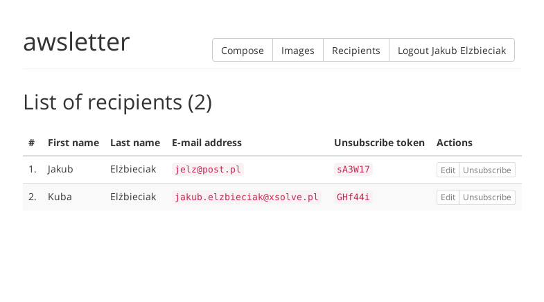
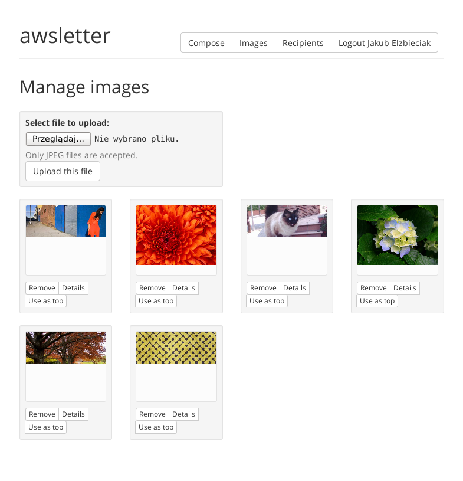
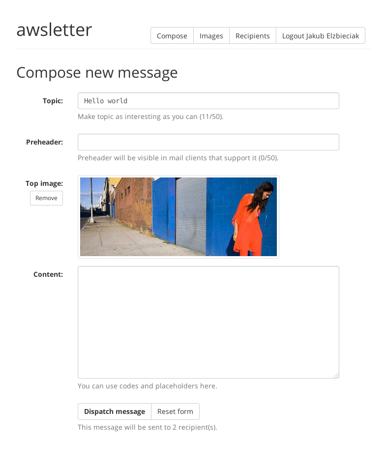
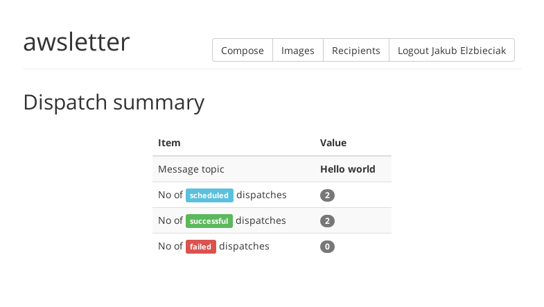

# awsletter

Complete newsletter application that has no "old-style" backend components. [See how does it look like](#how-does-it-look-like). All features are implemented using Amazon's cloud stack.

### To be more specific

  - [Login with Amazon](http://login.amazon.com/) is used as an authentication provider
  - [S3](http://aws.amazon.com/s3/) bucket is used to store images
  - [SES](http://aws.amazon.com/ses/) is used to send e-mails
  - [DynamoDB](http://aws.amazon.com/dynamodb/) is used to store e-mail addresses (not implemented yet, using mock)
  - [Amazon Lambda](http://aws.amazon.com/lambda/) is used to resize images and communicate with APIs (SES, Twilio)
  - AWS SDK for JavaScript is used to call Amazon services both in [client applications](http://aws.amazon.com/developers/getting-started/browser/) and [Lambda functions](http://aws.amazon.com/developers/getting-started/nodejs/)
  - additionally, [Twilio](http://www.twilio.com/) can be used to send SMS notifications

### Configuring AWS

It's the trickiest part of the whole setup. Steps depend on each other, so do it in presented order.

#### Preconditions

  - remember to create all services in one region (that will be yours `aws.region` in config file)
  - create "Login with Amazon" application (`amazonLogin.clientId`)
  - create S3 bucket for images (`aws.imagesBucketName`) and add CORS config (`aws/images-bucket-cors-config.xml`)
  - verify domain or e-mail sender address for SES (`sender` property in config)

#### Create IAM role for Lambda

  - this role will be used by Lambda when executing functions
  - create `awsletter_lambda_executor` role (of course you can name it as you wish)
  - add policy (`aws/lambda-executor-policy.json`) to this role; provide template with a real bucket name
  - add trust policy (`aws/lambda-executor-trust-policy.json`) to this role; it states that Lambda can assume this role

#### Create Lambda functions

There's a list of functions to create: 

| Function name            | Code                      | Memory | Timeout | Notes                      |
| ------------------------ | ------------------------- | ------ | ------- | -------------------------- |
| `awsletter-send-mail`    | `lambdas/send-mail.js`    | 512    | 5       |                            |
| `awsletter-send-sms`     | `lambdas/sens-sms.js`     | 256    | 10      | Provide Twilio credentials |
| `awsletter-resize-image` | `lambdas/resize-image.js` | 512    | 15      | Provide image width        |

Please note:

  - previously created role (I call it `awsletter_lambda_executor`) should be used for all functions
  - names of functions can differ in your setup, but remember that these will be used as `aws.mailFunctionName` and `aws.smsFunctionName` in config file
  - memory and timeout are values that I use, no guarantee that these will work well for you

#### Create invocation role for resize function

  - this role allows S3 bucket to call resize function
  - create `awsletter_lambda_resize_caller` role
  - add policy (`aws/lambda-resize-caller-policy.json`) to this role; provide template with function name
  - add trust policy (`aws/lambda-resize-caller-trust-policy.json`) to this role; provide template with bucket name; this policy states that S3 bucket can assume this role (so it can invoke resize function)

#### Create web role

  - this role is assumed when user logs into client application
  - it allows to manipulate bucket and invoke functions
  - create `awsletter_web_user` role
  - add policy (`aws/web-role-policy.json`) to this role; provide template with bucket name and function names
  - add trust policy (`aws/web-role-trust-policy.json`) to this role; provide template with "Login with Amazon" Client ID

#### That's a lot to do

Yeah, I know. I'm working on automating this process. In case of any (project-related) problems, you can contact me, I'll try to help.

### Setting up client locally

Just clone repository, copy reference config file and adjust it:

```sh
$ git clone git@github.com:jelz/awsletter.git
$ cd awsletter
$ cp config/config.js.dist public/app/config.js
$ vi public/app/config.js
```

Then you need to serve `public/` directory. Use `python -m SimpleHTTPServer` or `grunt` (default task runs server).

### How does it look like?

##### List of recipients

---

##### Image management

---

##### Composing an e-mail

---

##### Dispatch summary


### Author

[@jelzbieciak](https://twitter.com/jelzbieciak) 

### License

MIT
